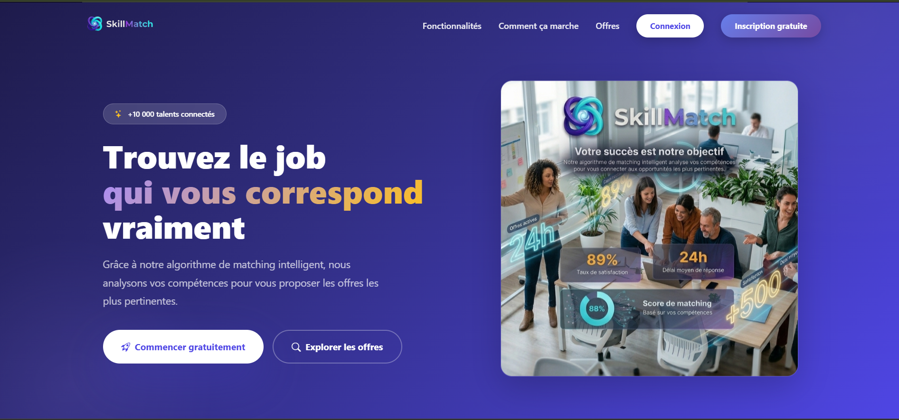
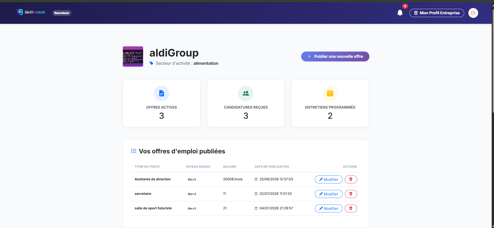
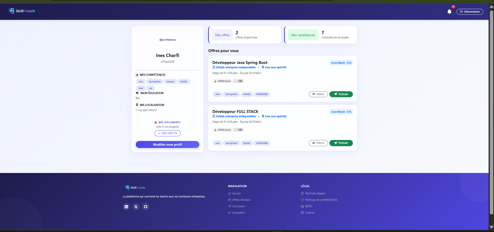
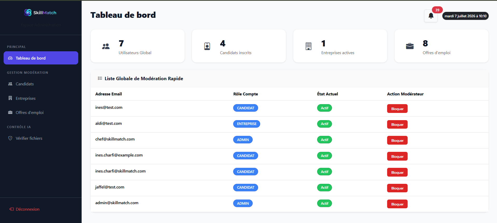
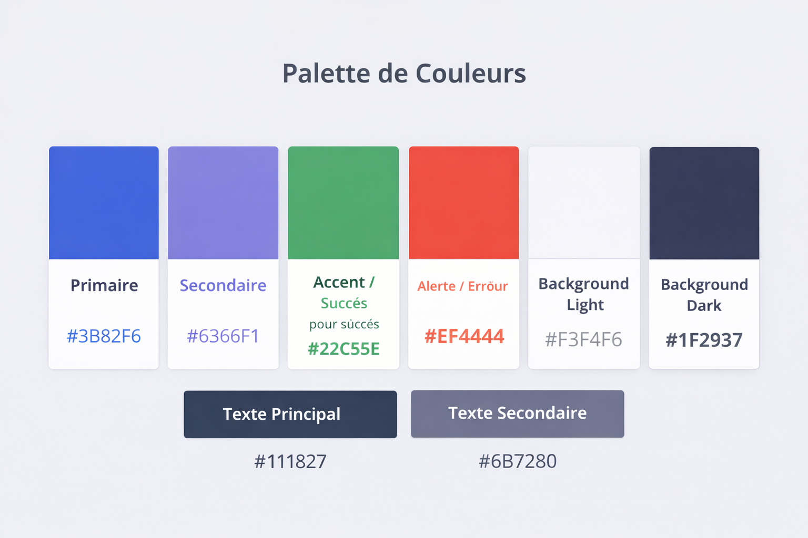
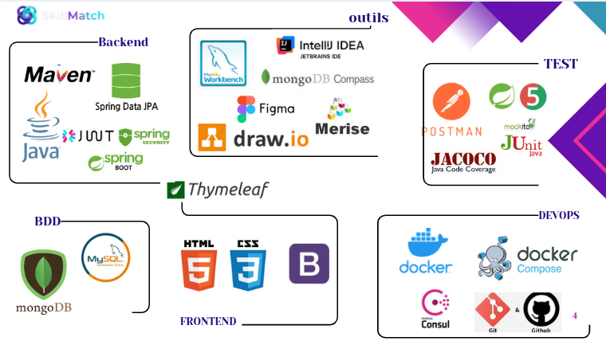
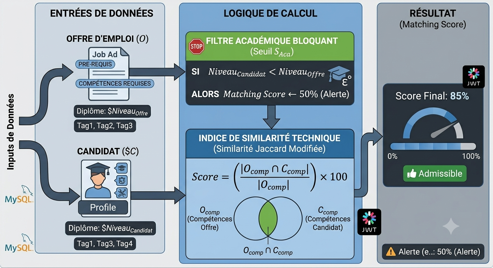
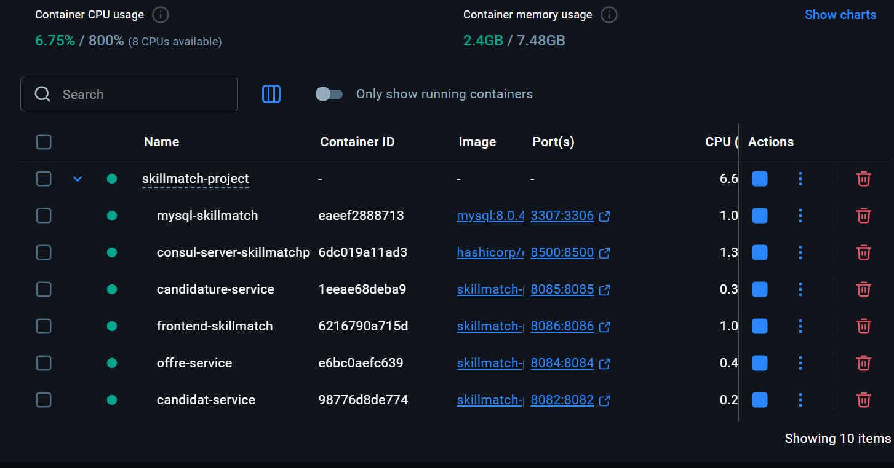
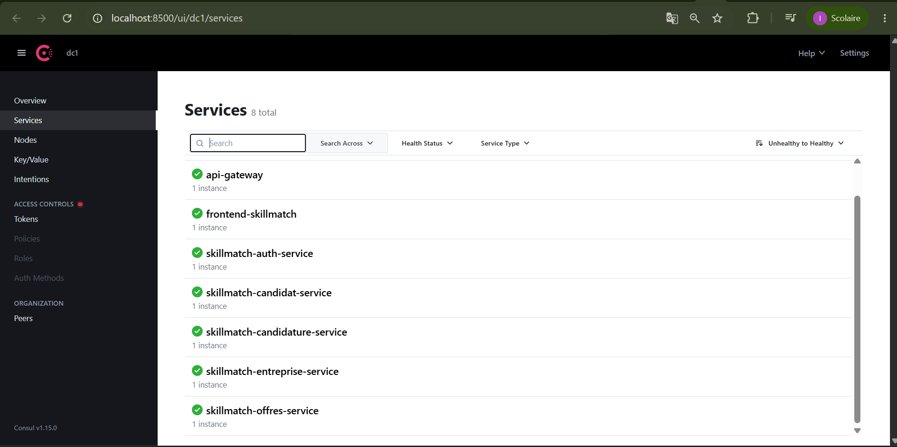

   
  <strong>SkillMatch</strong> : Cloud-Native Recruitment Ecosystem

  
  
  
  
  
  

---

##  Sommaire
- [Pourquoi SkillMatch ?](#-pourquoi-skillmatch-)
- [Aperçu / Preview](#️-aperçu--preview)
- [Fonctionnalités principales](#fonctionnalités-principales)
    - [Candidat](#candidat)
    - [Entreprise](#entreprise)
    - [Administrateur](#administrateur)
    - [Fonctionnalités transverses](#fonctionnalités-transverses)
- [ Architecture technique](#️-architecture-technique)
- [ L’algorithme de matching](#-lalgorithme-de-matching)
- [🛡 Sécurité & RGPD](#️-sécurité--rgpd)
- [🐳 DevOps & Qualité logicielle](#-devops--qualité-logicielle)
- [ Installation & Lancement](#-installation--lancement)
- [ Roadmap](#-roadmap)
- [👨‍💻 Auteur](#-auteur)

---

##  Pourquoi SkillMatch ?

SkillMatch est une solution **Fullstack distribuée** visant à résoudre la problématique du *"bruit sémantique"* dans le recrutement informatique.  
Contrairement aux plateformes classiques, SkillMatch automatise la mise en relation entre candidats et recruteurs grâce à un **moteur de matching intelligent** basé sur l’indice de similarité de **Jaccard**.

###  Points d'Excellence Technique :
- **Architecture Microservices Découplée** : Séparation granulaire des domaines métier (Auth, Offres, Candidatures, Notifications) permettant un déploiement indépendant et une scalabilité optimale.
- **Moteur de Matching Sémantique** : Implémentation d’un algorithme de calcul côté serveur avec phase de Tokenisation (nettoyage et normalisation).
- **Persistance Polyglotte** : Utilisation stratégique de **MySQL** (garantie ACID pour les transactions) et **MongoDB** (haute disponibilité pour les logs et notifications).
- **Interopérabilité Avancée** : Communication via **OpenFeign** avec résolution d’un verrou technique majeur : la propagation du contexte de sécurité JWT via un intercepteur personnalisé.

---

## 🖼 Aperçu / Preview

| Page d’accueil | Maquette globale |
|----------------|------------------|
|  |  |

| Dashboard Entreprise | Dashboard Candidat | Dashboard Admin |
|----------------------|--------------------|-----------------|
|  |  |  |

| Palette de couleurs | Stack technique |
|---------------------|-----------------|
|  |  |

---

## Fonctionnalités principales

###  Candidat
- Inscription / connexion sécurisée (JWT)
- Gestion de profil (nom, prénom, compétences, niveau scolaire, téléphone, adresse)
- Upload de CV (PDF) et photo de profil
- Visualisation des offres recommandées avec score de compatibilité
- Postulation en un clic
- Suivi de l’historique des candidatures (statuts : *EN_ATTENTE*, *ACCEPTÉE*, *REFUSÉE*, *ENTRETIEN*)
- Notifications en temps réel (changement de statut, invitation à un entretien)

###  Entreprise
- Création et gestion du profil entreprise (logo, description, secteur…)
- Publication, modification et suppression (logique) d’offres d’emploi
- Dashboard avec liste des offres actives et nombre de candidatures reçues
- Consultation détaillée des candidatures (score matching, CV, statut)
- Planification d’entretiens (date, lieu, notes) – la candidature passe automatiquement à *ENTRETIEN*
- Statistiques : total candidatures, entretiens programmés

### 🛡 Administrateur
- Supervision globale : nombre d’utilisateurs, candidats, entreprises, offres, candidatures
- Gestion des utilisateurs (activation/désactivation, changement de rôle)
- Modération des fichiers téléchargés (CV, logos) avec analyse IA simulée (score de conformité)
- Modération des offres (consultation et suppression si inappropriées)
- Téléchargement sécurisé des fichiers via un tunnel API Gateway

###  Fonctionnalités transverses
- **Matching automatique** : calcul d’un score 0‑100 basé sur niveau scolaire (40%) et compétences (60%)
- **Notifications** : alertes internes à la plateforme (via microservice dédié)
- **API Gateway** : point d’entrée unique (port 8080) avec routage et transmission du token JWT
- **Service Discovery** : Eureka pour l’enregistrement dynamique des microservices
- **Resilience4j** : circuit breakers et fallbacks sur tous les appels inter-services
- **PWA** : installation sur mobile / bureau, navigation hors ligne partielle

---

##  Architecture technique

### Microservices

| Service | Port | Base de données | Responsabilité principale |
|---------|------|----------------|---------------------------|
| `frontend-skillmatch` | 8086 | `skillmatchingApp` | pages web et templates en Thymeleaf, CSS, JS |
| `Auth Service` | 8081 | `skillmatchingApp` | Authentification, JWT, rôles, administration utilisateurs |
| `Candidat Service` | 8082 | `skillmatchingApp` | Profil candidat, CV, compétences, niveau scolaire |
| `Entreprise Service` | 8083 | `skillmatchingApp` | Profil entreprise, logo, secteur |
| `Offre Service` | 8084 | `skillmatchingApp` | CRUD offres, recherche, enrichissement (nom entreprise, nb candidatures) |
| `Candidature Service` | 8085 | `skillmatchingApp` | Postulation, score matching, statuts, entretiens, notifications |
| `API Gateway` | 8080 | - | Routage, agrégation, sécurité |
| `Consul Server` |27017 | - | Service discovery |

### Stack technologique

| Couche | Technologies |
|--------|--------------|
| **Backend** | Java 17, Spring Boot 3.2, Spring Cloud (OpenFeign, Gateway, Eureka) |
| **Résilience** | Resilience4j (circuit breaker, retry, timeout) |
| **Base de données** | MySQL (une base par service) / H2 pour les tests |
| **Frontend** | HTML5, Bootstrap 5, JavaScript (appels fetch vers l’API Gateway), Service Worker, manifest.json |
| **Sécurité** | JWT (jjwt), Spring Security, BCrypt |
| **Communication** | Feign clients avec fallbacks |
| **Stockage fichiers** | système de fichiers local (`uploads/cvs`, `uploads/photos`, `uploads/logos`) |
| **Tests** | JUnit 5, Mockito, @WebMvcTest, @SpringBootTest, H2 |

---

##  L’algorithme de matching

Le calcul du score de pertinence est traité **côté serveur** pour garantir l’impartialité :

- **FR** : Extraction des tags → Normalisation (minuscules/espaces) → Calcul d’intersection via **Jaccard**.
- **EN** : Skills extraction → Normalization (trim/lowercase) → Jaccard intersection calculation.

**Résultat** : Score en pourcentage injecté dynamiquement dans le Dashboard.

---

##  Sécurité & RGPD "By Design"

- **Protection OWASP** : Défense native contre les injections SQL (JPA) et les failles XSS (Thymeleaf).
- **Hachage BCrypt** : Utilisation d’un hachage adaptatif (facteur 12) avec sel pour les mots de passe.
- **Droit à l’oubli** : Implémentation des suppressions en cascade (*Cascade Delete*) assurant l’effacement total des données personnelles.

---

## 🐳 DevOps & Qualité logicielle

J’ai optimisé le déploiement via des **Builds Multi‑étapes** dans Docker pour réduire la surface d’attaque et la taille des images :

- **Tests** : Pyramide de tests avec JUnit 5 et Mockito.
- **Couverture** : Mesurée par Jacoco (taux > 70% sur les services critiques).

---

##  Installation & Lancement

### Prérequis
- Docker & Docker Compose
- Maven 3.8+ / Java 17
  
  

### Commandes

Clonez le projet :
git clone https://github.com/ines-charfi/skillmatch-project.git
#cd skillmatch
#mvn clean install -DskipTests
#docker-compose up --build -d

##  Roadmap / Future Evolutions
 Apache Kafka : Passage à une architecture orientée événements.

 NLP Integration : IA pour comprendre les synonymes de compétences.

 Kubernetes : Orchestration de cluster pour la production.

## 👨‍💻 Auteur / Author
Ines Charfi
Développeuse Web et Web Mobile
Session CDPI Martigues 2025/2026
Projet de validation de Titre Professionnel
